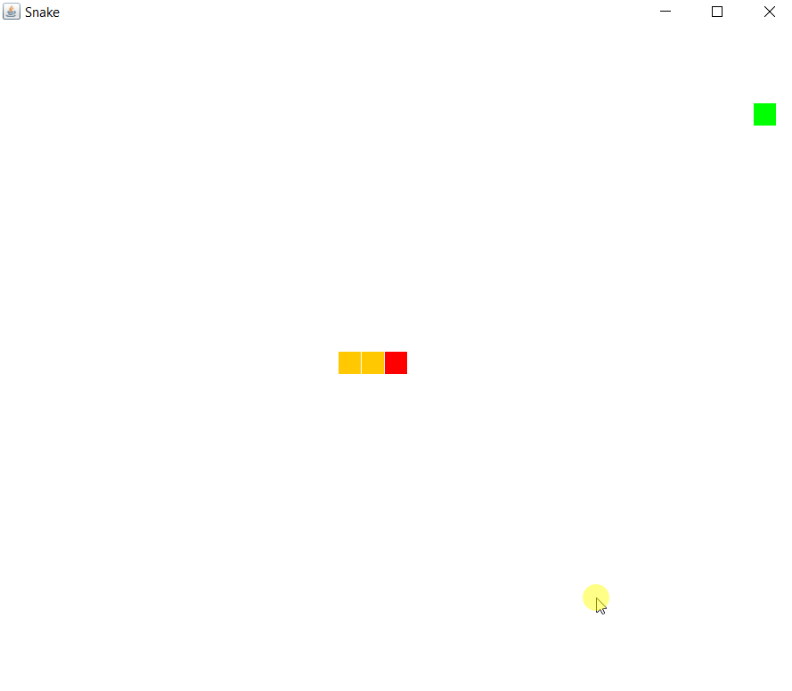

# snake-game

Simple snake game created using Java Swing/AWT and the Model-View-Controller (MVC) design pattern. Control the snake using arrow keys. Hitting the screenborders or one of the body parts of the snake ends the game.

Run the game using the SnakeApp class

